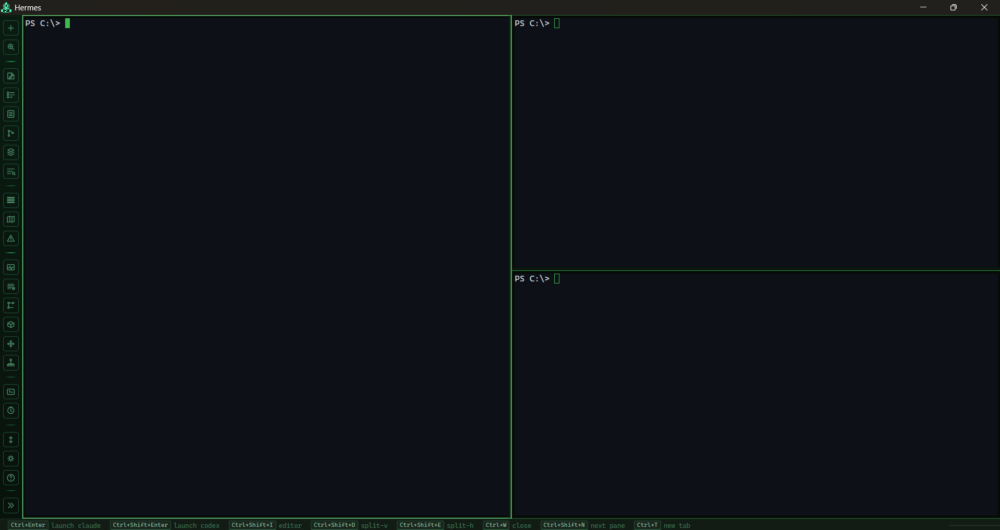
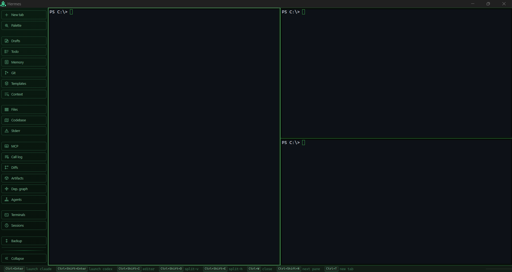

<div align="center">
  
  <h1>Hermes</h1>
  <p>Multi-agent terminal workspace for Claude Code with a built-in MCP server.</p>
  <p>
    
    =18" />
    
    
  </p>
</div>

---

## Why Hermes?

Claude Code is powerful but single-threaded by design — one agent, one terminal, one task at a time. Real projects benefit from parallelism: an orchestrator delegating to specialists, multiple agents working different parts of a codebase simultaneously, or a reviewer running alongside a writer.

Hermes solves the coordination problem. It gives you a single window with as many agent terminals as you need, a built-in MCP server so agents can communicate with each other, and a suite of panels to observe what's happening across all of them — diff timeline, agent tree, shared state, semantic search — without context-switching between windows.

It is **not** a cloud service or a wrapper around the Claude API. Everything runs locally. Agents connect to Hermes via MCP the same way they connect to any other tool.

---

Hermes is a local multi-agent terminal environment built for practical orchestration. Run several Claude Code (or Codex) agents in parallel, keep all their work visible in one place, and coordinate between them through a built-in MCP server — without juggling separate terminal windows.

## Features

### Terminal workspace
- Multi-tab workspaces with layout presets and snapshot persistence across sessions
- Dynamic split-pane terminals with draggable dividers
- Terminal manager sidebar with cross-tab terminal focus, restart, and close
- Inline terminal editor popup (`Ctrl+Shift+I`) for composing input before sending
- Predictive command-history autocomplete with Tab-to-accept
- Voice input via `Ctrl+Space` — records mic audio, transcribes locally with Whisper (`@xenova/transformers`), and injects text into the focused terminal

### Agent coordination
- **Live dependency graph** — visual orchestration tree fed by `upsert_agent_node` and `report_tool_call` telemetry
- **Sub-agent spawning** — AgentTreePanel for parent-child agent orchestration
- **MCP monitor** — live panel for inspecting all MCP traffic in real time
- **Shared state** — cross-agent key-value store via `set_shared_state` / `get_shared_state`
- **Pub/sub messaging** — named channels via `post_message` / `read_messages`
- **Diff Timeline** — chronological write/edit history with file metadata, reasoning, and line-level additions/removals
- **Artifact Collector** — agents submit deliverables via `submit_artifact`; review them in the Artifacts panel with preview, copy, and save

### Project tools
- **Git workflow panel** — full-screen staging, diffing, and committing (per-file stage/unstage/discard, coloured diff, commit message)
- **File explorer** — sidebar tree browser; click any file to open it in a full-screen code viewer with syntax highlighting (11 languages) and line numbers
- **Codebase memory map** — visual file browser with chunk and vector metadata
- **Semantic search** — `Ctrl+Shift+F` vector search with scope toggle (Code / Events / All) and score threshold; backed by SQLite + fastembed, continuously indexed across sessions

### Prompt tools
- **Prompt drafts** — compose, save, and manage reusable prompts; optional file-sync to `config.promptDraftsFolder`
- **Prompt templates** — persistent named templates with one-click send to focused terminal
- **Agent memory panel** — per-agent `CLAUDE.md` / `AGENTS.md` viewer and editor
- **Terminal summarisation** — "summarise" button on focused pane (appears when output exceeds 500 chars); Claude-powered via `summarize_terminal_output` MCP tool with SSE streaming

### Launch & sessions
- Auto MCP injection — `Ctrl+Enter` (Claude Code) and `Ctrl+Shift+Enter` (Codex) launch with Hermes MCP config pre-injected
- Session manager sidebar with persistent Claude/Codex session references
- Import/export — full workspace snapshot backup and restore (settings + layouts + sessions)
- Custom agent labels — 4 configurable per-terminal labels in settings

---

## MCP Integration

### Startup snippet for `CLAUDE.md` / `AGENTS.md`

Add this block to any project where agents will run inside Hermes:

````md
## Hermes MCP

You are running inside Hermes. An MCP server is available at `http://localhost:2337`.

### Startup (required)
Call `register_agent` immediately at session start with a stable `id` (e.g. `agent-<role>`) and a human-readable `label`. Then call `upsert_agent_node` to declare yourself in the agent tree.

### Lifecycle — call on every significant step
- `upsert_agent_node` — update `status` (`pending|running|done|error`) and `progress` (0–100) as you work. Set `model` and `token_burn` if known.
- `append_agent_activity` — structured log entries (`level: info|warn|error`). Use for task start, key decisions, errors, and completion.

### Coordination
- `set_shared_state` / `get_shared_state` — shared KV store. Use for cross-agent config, results, locks, or status flags. Keys are global; namespace them (`agent-id:key`).
- `post_message` / `read_messages` — pub/sub channels. Use named channels (`tasks`, `results`, `errors`, etc.) to broadcast or consume structured messages. `read_messages` accepts an optional `since` timestamp.
- `list_agents` — discover other active agents (id, label, status). Check this before signalling.
- `signal_agent` — direct handoff to another agent by `agent_id`. The message appears in their terminal. Use for blocking hand-offs or urgent interrupts.

### File telemetry (required on every file op)
Call `report_tool_call` after each file read/write/edit/delete:
```json
{ "agent_id": "...", "tool_name": "Read|Write|Edit", "file_path": "...", "op": "read|write|edit|delete" }
```
Include `diff`, `lines_added`, `lines_removed`, `reasoning` when available — Hermes uses this to build the live dependency graph and diff timeline.

### Deliverables
- `submit_artifact` — submit any file-like deliverable (code, reports, configs) with `filename`, `content`, and `mime_type`. Surfaced in the Artifacts panel.

### Semantic search
- `semantic_search` — vector search over indexed codebase (`scope: "code"`) or MCP event history (`scope: "events"`). Use before duplicating work or to find prior agent outputs. Rate-limited to 5 req/10 s.

### Patterns
- Orchestrator spawns sub-agents → call `upsert_agent_node` with `parent_id` set to orchestrator's id.
- After task handoff: `signal_agent` + `set_shared_state` with result key.
- On error: `upsert_agent_node` with `status: "error"` + `append_agent_activity` with `level: "error"`.
- Keep all messages/logs concise — one line per entry.
````

### MCP server config

```json
{
  "mcpServers": {
    "hermes": {
      "type": "http",
      "url": "http://localhost:2337"
    }
  }
}
```

> **Note:** The MCP server requires a session token. When launching via `Ctrl+Enter` (Claude Code) or `Ctrl+Shift+Enter` (Codex), Hermes automatically injects the token via `--mcp-config` pointing to `<userData>/hermes-mcp.json`. The snippet above is for reference; manual config requires the `x-hermes-token` header, which you can copy from that file.

### MCP tool reference

| Tool | Description |
|---|---|
| `register_agent` | Register session with stable `id` + readable `label` |
| `list_agents` | List all registered agent sessions with labels and status |
| `upsert_agent_node` | Upsert a node in the orchestration tree (status / progress / model / token_burn) |
| `append_agent_activity` | Append a structured log entry to an agent node |
| `post_message` | Publish a message to a named channel |
| `read_messages` | Read messages from a channel (optional `since` timestamp filter) |
| `set_shared_state` | Write a value to the shared key-value store |
| `get_shared_state` | Read a value from the shared key-value store |
| `signal_agent` | Send a direct message to another agent; also writes to its PTY |
| `submit_artifact` | Submit a deliverable (filename / content / mime_type) to the Artifacts panel |
| `report_tool_call` | Record file op telemetry (`read\|write\|edit\|delete`) with optional before/after diff |
| `summarize_terminal_output` | Claude-powered terminal summary with SSE streaming chunks |
| `semantic_search` | Vector search over indexed codebase and/or MCP event history (`scope: code\|events\|all`) |

---

## Setup

Requires **Node.js 18+** and native build tools for `node-pty` and `better-sqlite3`:

| Platform | Requirement |
|---|---|
| Windows | [Visual Studio Build Tools](https://visualstudio.microsoft.com/visual-cpp-build-tools/) — "Desktop development with C++" |
| macOS | Xcode Command Line Tools: `xcode-select --install` |
| Linux | `build-essential`, `python3` |

```bash
npm install
npm run dev
```

`npm install` automatically runs `@electron/rebuild` to compile `node-pty` and `better-sqlite3` for the installed Electron version. If it fails:

```bash
npm run rebuild
```

On Windows, if the rebuild fails only for `node-pty` (winpty build issue), rebuild `better-sqlite3` independently:

```bash
npx electron-rebuild --only better-sqlite3
```

---

## Keyboard Shortcuts

> On macOS, substitute `Cmd` for `Ctrl`. On Windows/Linux, the native menu bar is hidden — use shortcuts and the left icon rail.

| Shortcut | Action |
|---|---|
| `Ctrl+Enter` | Launch Claude Code in focused terminal |
| `Ctrl+Shift+Enter` | Launch Codex in focused terminal |
| `Ctrl+Alt+R` | Restart Claude Code in focused terminal |
| `Ctrl+Alt+Shift+R` | Restart Codex in focused terminal |
| `Ctrl+Alt+P` | Open command palette |
| `Ctrl+T` | Open a new terminal tab |
| `Ctrl+Shift+D` | Split pane vertically |
| `Ctrl+Shift+E` | Split pane horizontally |
| `Ctrl+W` | Close focused pane |
| `Ctrl+Shift+W` | Close all side panels and code viewer |
| `Ctrl+Shift+N` | Focus next pane |
| `Ctrl+Shift+P` | Focus previous pane |
| `Ctrl+1` / `Ctrl+2` | Focus pane 1 / 2 |
| `Ctrl+Shift+I` | Open inline editor for focused terminal |
| `Ctrl+Shift+K` | Clear focused terminal |
| `Ctrl+Space` | Start / stop voice recording |
| `Ctrl+Alt+B` | Toggle MCP monitor panel |
| `Ctrl+Alt+T` | Toggle terminal manager sidebar |
| `Ctrl+Alt+Y` | Toggle session manager sidebar |
| `Ctrl+Alt+M` | Toggle codebase memory map panel |
| `Ctrl+Shift+F` | Toggle semantic search panel |
| `Ctrl+Alt+G` | Toggle live dependency graph panel |
| `Ctrl+Alt+J` | Toggle sub-agent spawning panel |
| `Ctrl+Alt+S` | Copy shared state to clipboard |
| `Ctrl+,` | Open settings |
| `F1` / `Ctrl+/` | Show keyboard shortcuts help |

---

## Screenshots

<div align="center">
  
  <br /><br />
  
</div>

---

## Building

### Windows

```bash
npm run dist:win
```

### macOS

```bash
npm run build && npx electron-builder --mac dmg
```

### Linux

```bash
npm run build && npx electron-builder --linux
```

Output is written to `release/`.
